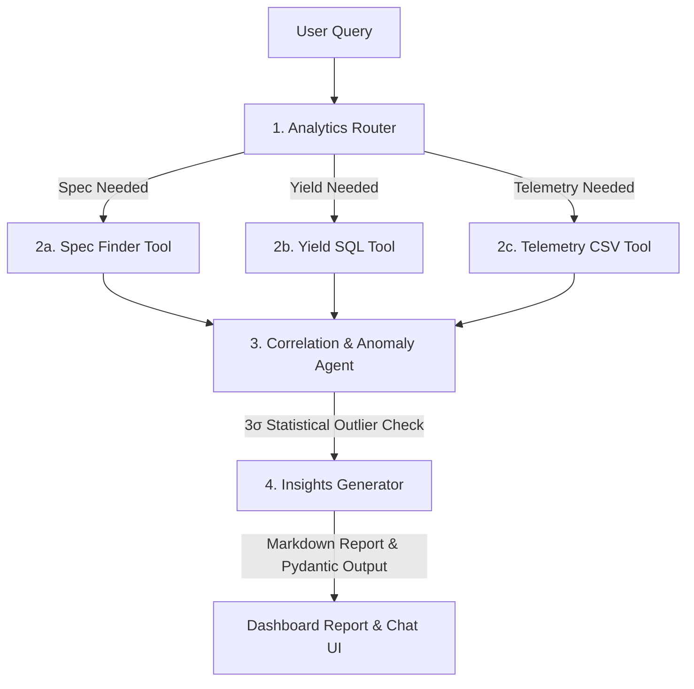

# ASIC Copilot: Multi-Source Semiconductor Analytics Agent

> [!NOTE]
> **Demo & Concept Proof**: This application is a prototype demonstrator and not a production utility. It is designed to illustrate how **Agentic AI** workflows (specifically stateful multi-agent pipelines) can be applied to the domain of **hardware engineering and ASIC post-silicon characterization/bring-up analysis**.

ASIC Copilot demonstrates the concept of using agentic AI to coordinate and cross-reference multiple fragmented hardware sources, specifically unstructured design specifications (`asic_spec.md`), structured wafer yield databases (wafer parametric measurements), and time-series sensor telemetry logs (`telemetry_*.csv`), to automatically identify silicon anomalies such as static leakage outliers and critical thermal exceptions.

---

## System Architecture

The application uses **LangGraph** to build a stateful, routing multi-agent pipeline, and **FastAPI** to serve the backend APIs and host the compiled **Vite + React** single-page web app.



---

## Features

1.  **Analytics Router (Supervisor)**: Automatically parses natural language questions using Gemini 2.5 Flash and determines which files/databases need querying.
2.  **Data Collector Tools**:
    *   **Spec Finder**: Looks up core voltage, maximum safe temperature ($T_{\text{jmax}}$), and leakage parameters from design docs (`asic_spec.md`).
    *   **Yield SQL Tool**: Performs parametric database queries matching wafer test statistics.
    *   **Telemetry CSV Tool**: Parses time-series sensor records for core voltage, temperature, and dynamic power during stress tests.
3.  **Correlation Agent & 3-Sigma Anomaly Engine**: Calculates a standard deviation threshold to detect abnormal static leakage power:
    $$\text{Power}_{\text{leakage}} > \mu_{\text{leakage}} + 3\sigma_{\text{leakage}}$$
    It also checks for temperature violations where $T > T_{\text{jmax}}$.
4.  **Insights Generator**: Creates a professional, markdown-formatted silicon report for product managers, flagging anomalous chip IDs and identifying root causes.
5.  **Interactive Web Dashboard**: A single-page, custom green-accented dark mode interface containing:
    *   An LLM chat workspace.
    *   A live, terminal-style step-by-step trace showing the LangGraph state modifications and agent decisions.
    *   An interactive data viewer displaying specs, yield tables, and telemetry line graphs (using Recharts).

---

## Getting Started

### Prerequisites
*   Python 3.11+
*   [uv](https://github.com/astral-sh/uv) (Python package installer and runner)
*   Node.js (for building the frontend)
*   Google Gemini API Key (set as an environment variable)

### Local Development Setup

1.  **Clone the Repository**:
    ```bash
    git clone <repository_url>
    cd asic-copilot
    ```

2.  **Initialize the Backend**:
    Initialize the project and install package dependencies using `uv`:
    ```bash
    uv sync
    ```

3.  **Build the Frontend**:
    Navigate to the `frontend/` directory, install dependencies, and build the static assets:
    ```bash
    cd frontend
    npm install
    npm run build
    cd ..
    ```
    This outputs the compiled React assets directly into the backend's static directory.

4.  **Run the Server**:
    Set your Gemini API key and start the FastAPI server:
    ```bash
    # Windows PowerShell
    $env:GEMINI_API_KEY="your_api_key_here"
    uv run main.py

    # Linux/macOS
    export GEMINI_API_KEY="your_api_key_here"
    uv run main.py
    ```
    Open `http://localhost:8000` in your browser.

---

## Running Tests

Execute the automated test suite to validate routing classification, standard deviation calculations, and end-to-end graph state routing:
```bash
uv run pytest
```

---

## Deployment

To deploy the unified application to **Hugging Face Spaces (Docker)**:

1.  Create a new Space on Hugging Face.
2.  Choose **Docker** as the SDK and select the **Blank** template.
3.  Go to the **Settings** tab in your Space and add `GEMINI_API_KEY` under **Variables and Secrets**.
4.  Push your code to the Hugging Face Git remote repository.
